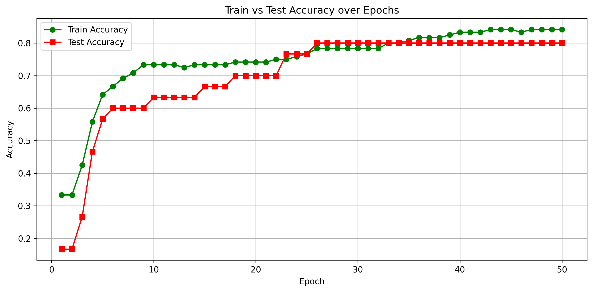

# Predusk_ML_Assignment1
Basic ML Classification using Neural Networks (Iris Dataset)

## Project Overview
This project implements a 2-layer neural network from scratch (without using high-level PyTorch wrappers) to classify Iris flower species. It demonstrates fundamental ML concepts: data preprocessing, manual model building, training with SGD, and evaluation.

## Files Included

Predusk_ML_ass1.ipynb – Main Jupyter notebook.

accuracy_epoch_plot.png – Accuracy vs Epochs plot.

redme.md – How to run and result summary.

iris_data - file containing 150 entries in the dataset (4 features, 3 classes).

## Install Dependencies

```bash
pip install torch pandas matplotlib scikit-learn
```
## Run the Notebook
```bash
jupyter notebook iris_classifier.ipynb
```
## Dependencies
torch (PyTorch)

pandas

matplotlib

scikit-learn

## accuracy-vs-epoch plot


## Final Results

**Final Train Accuracy**: 84.17%
**Final Test Accuracy** : 80.00%


